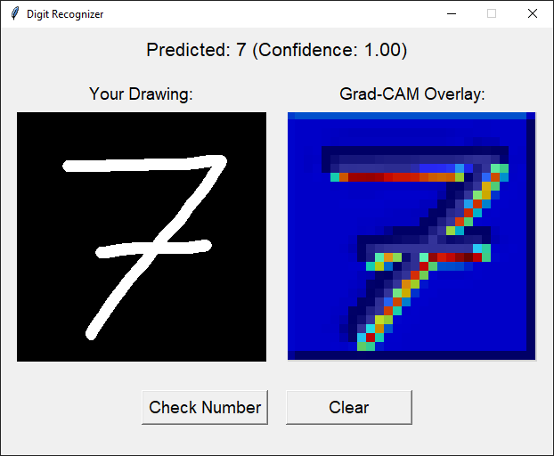
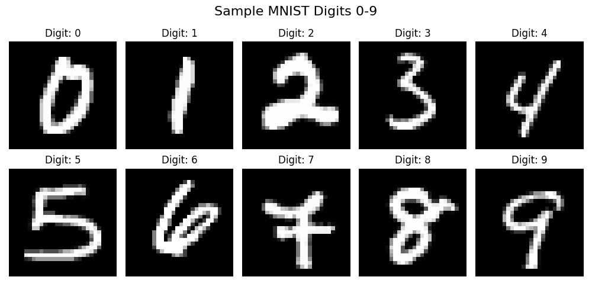
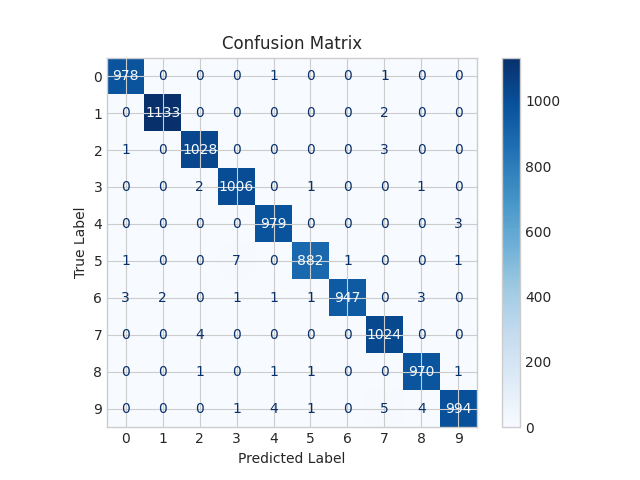
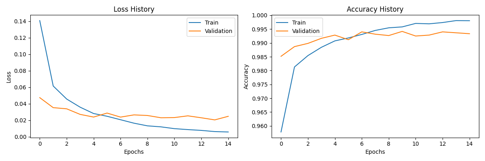

# 🧠 MNIST Digit Recognizer with PyTorch & Tkinter
Handwritten digit recognition with PyTorch, Tkinter GUI, and Grad-CAM visualizations.

## 📌 Overview

This project implements a Convolutional Neural Network in **PyTorch** for classifying handwritten digits. It also includes a Tkinter-based graphical interface for real-time digit recognition, as well as performance evaluation tools and model interpretability via Grad-CAM.

Grad-CAM provides visual explanations by highlighting areas of the input image that are most influential in the model's decision-making.

---

## 🚀 Features

- **Deep Learning Model:**
  - Convolutional Neural Network tailored for grayscale digit classification.

- **Graphical Interface:**
  - Lets users draw digits and see live predictions from the model.

- **Model Training & Evaluation:**
  - Save/load model checkpoints.
  - Data loading, augmentation, and preprocessing.
  - Training with validation, early stopping, and learning rate scheduling.

- **Visualization Tools:**
  - Sample visualization of MNIST digits.
  - Confusion matrix to assess model accuracy.
  - Training and validation loss/accuracy plots.
  - Grad-CAM heatmaps for model interpretability.

- **Reproducibility:**
  - Fixed seeds for Python, NumPy, and PyTorch to ensure deterministic results.

---

## 🖼️ Digit Recognizer Interface

This is the main application where the user can draw digits and get predictions from the model:

<div align="center">
  
</div>

---

## ⚙️ Requirements

To run this project, install the required Python packages using pip:

```bash
pip install torch torchvision scikit-learn numpy matplotlib tqdm
```

---

## 🔢 Dataset and Sample Digits

The model is trained on the **MNIST dataset**, a well-known collection of grayscale images representing handwritten digits from 0 to 9. 

The dataset is split into three subsets:
- **Test set:** 10,000 images
- **Training set:** 54,000 images  
- **Validation set:** 6,000 images

Below is a grid of sample digits from the dataset:

<div align="center">
  
</div>

---

## 📊 Model Performance Summary

- **Test Accuracy:** `99.41%`
- **Classification Report:**

```
               precision    recall  f1-score   support

           0       0.99      1.00      1.00       980
           1       1.00      1.00      1.00      1135
           2       0.99      1.00      0.99      1032
           3       0.99      1.00      0.99      1010
           4       0.99      1.00      0.99       982
           5       1.00      0.99      0.99       892
           6       1.00      0.99      0.99       958
           7       0.99      1.00      0.99      1028
           8       0.99      1.00      0.99       974
           9       0.99      0.99      0.99      1009

    accuracy                           0.99     10000
   macro avg       0.99      0.99      0.99     10000
weighted avg       0.99      0.99      0.99     10000
```

- **Confusion Matrix:**

<div align="center">
  
</div>

---

## 📈 Training Progress & Accuracy Curves

Visualizes model performance over training epochs:
- **Blue:** Training loss/accuracy
- **Orange:** Validation loss/accuracy

<div align="center">
  
</div>

---

## License
This project is licensed under the MIT License - see the [LICENSE](LICENSE) file for details.
